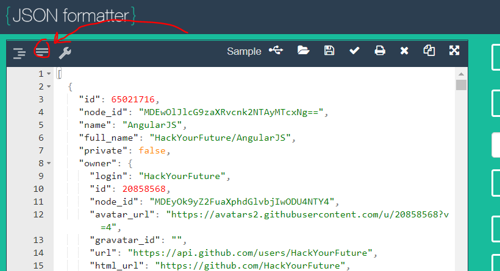

# Homework

First off, congratulations on coming this far, well done!

## Step 1: Lets get real comfortable with map, filter and sort.

Use the carGenerator function to generate 10 cars. The file with the function is here: 
[carGenerator.js](/JavaScript2/Week4/assets/carGenerator.js)

You call it like this: 
generateCars(10);

Create the following arrays:

- 1.1: Cars with speeds between 30 and 60

- 1.2: The makes of the cars that are not lightyellow, so the array is going to look like this: ['BMW', 'Fiat'] etc

- 1.3: Lets change the cars array so it can be read by a danish person. Return an array of objects where the key in the object called speed is called fart (danish for speed), the make is called maerke and the color is called farve. The output will look kind of like this:

```js
[
    {
        maerke: 'Volvo',
        fart: 45,
        farve: 'lightYellow',
    }
];
```


## Step 3: Some Challenges
Let's practice working with Objects and Arrays. Go to FreeCodeCamp and complete all challenges under "Object Oriented and Functional Programming" and the _first four challenges_ under "Basic Algorithm Scripting", up until 'Find the longest word in a string.'
https://www.freecodecamp.org/challenges/store-multiple-values-in-one-variable-using-javascript-arrays

## Step 4: Custom challenge 
1. Go to https://api.github.com/orgs/HackYourFuture-CPH/repos, you will see a list of the repositories our HYF organization has (yes it's a lot of JSON).
2. You can copy the JSON and put it in a string at the top of your `.js` file use this tool for that: https://jsonformatter.org/. Copy the json text into the jsonformatter and press this key:
> 
Now you have a json string you can copy into your file. Now print the name of the 3rd github repository to the console.
3. Make a `<ul>` with a `<li>` for each repository name (just like you did with the books in the previous assignment).
4. It should only display the modules that are actually being used in the curriculum at the moment, you of course know which those are, but if you need a reminder you can find them in our [curriculum overview](https://github.com/HackYourFuture/curriculum).
5. Use CSS to divide the page in two columns. The left column will have a list of the names for repository. The right column should have the following information about each repository: the number of `stargazers`, the number of `watchers`, the number of `forks`, the `language` of the repository.
6. place the `avatar_url` (logo) of our organization somewhere on a nice place in your page.

## Step 5: Hand in Homework:
Go over your homework one last time:

- Does every file run without errors and with the correct results?
- Have you used `const` and `let` and avoided `var`?
- Do the variable, function and argument names you created follow the [Naming Conventions](https://github.com/HackYourFuture/fundamentals/blob/master/fundamentals/naming_conventions.md)?
- Is your code well-formatted (see [Code Formatting](https://github.com/HackYourFuture/fundamentals/blob/master/fundamentals/naming_conventions.md))?

If you can answer yes to the above questions then you are ready to hand if the homework:
* Find the hyf-homework git repo (forked from [here](https://github.com/HackYourFuture-CPH/hyf-homework))
* Add your homework files in the Javascript/javascript2/week1 folder
* To finish the homework use the link in the top of your classes slack channel. 
---

🎉

