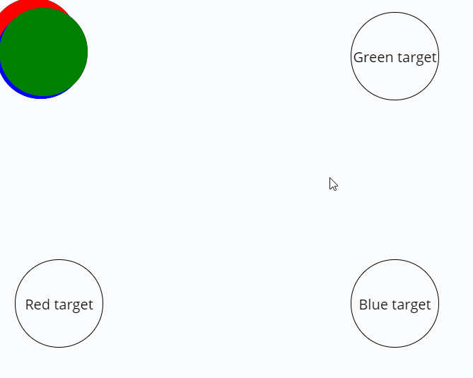

# Homework

## Why should i even do this homework?
Promises creates a **pleasant way of working with asynchronous code**. It will make your asynchronous code nearly look synchronous. It is possible to compose promises further developing the function part of javascript. 

Since promises is becoming standard in javascript, new browser api's use promises for interacting with them. `getUserMedia` for accessing webcam, `Navigator.getBattery()` for getting battery level, `Bluetooth.requestDevice()`, `serviceWorker` or `USB.requestDevice()`


### Movies exercise
This exercise is repetition of array functions. 

Fetch movies from this api: `https://gist.githubusercontent.com/pankaj28843/08f397fcea7c760a99206bcb0ae8d0a4/raw/02d8bc9ec9a73e463b13c44df77a87255def5ab9/movies.json`

1. Create an array of bad movies
2. Creat an array of bad movies since year 2000
3. Create an array of the titles of the bad movies since year 2000

## Promise that resolves after set time
Create a function that has one parameter: `resolveAfter`. **Calling this function** will **return a promise** that resolves after the `resolveAfter` seconds has passed. 

Here is an example: `makeUpYourOwnFunctionName(3)` will return a promise that resolves after 3 seconds.

Use the `makeUpYourOwnFunctionName` to log out the string `I am called asynchronously` after 6 seconds.

## Rewrite time
Rewrite [setTimeout](https://developer.mozilla.org/ro/docs/Web/API/window.setTimeout) and [navigator.geolocation.getCurrentPosition](https://developer.mozilla.org/en-US/docs/Web/API/Geolocation_API#JavaScript_Content) to promises. So instead of using [setTimeout](https://developer.mozilla.org/ro/docs/Web/API/window.setTimeout) and [navigator.geolocation.getCurrentPosition](https://developer.mozilla.org/en-US/docs/Web/API/Geolocation_API#JavaScript_Content) with callbacks, use it as a promise.

Example of usage

```js
setTimeoutPromise(3000)
    .then(() => {
        console.log('Called after 3 seconds');
    });

getCurrentLocation()
    .then((position) => {
        // called when the users position is found
        console.log(position);
    })
    .catch((error) => {
        // called if there was an error getting the users location
        console.log(error);
    });
```

## Fetching and waiting
**Only using promises**
1. Fetch some data from an api.
2. After that data has been fetched, wait 3 seconds
3. Log out the data from the api
4. *Optional* Now do all of these things using [chaining](readme.md#promise-chaining)

## Visual promise
This task is about visually understanding the difference between Promise.all and calling a promise one at a time.

If you go into the [promise-visual homework folder](homework/promise-visual) there is some html, css and some js. If you clone down the javascript repo, then you can simply copy the files into your hyf-homework js3 week 2 folder. Dont modify move-element.js, only work in main.js!

There is a function available to you called `moveElement`. It moves an element to a new position and returns a promise. `moveElement` takes a `DOM element` and an `object` specifying the `x` and `y` of the new position. It then returns a `promise` that resolves after the `DOM element` has been moved.

```js
// This code will move the li to the position 100, 100. Calling moveElement will return a promise that resolves after the li element has been moved. 
moveElement(document.querySelector('li'), {x: 100, y: 100})
    .then(() => {
        console.log('Element has been moved');
    });
```


Your task is to create two functions. 
- `translateOneByOne` - Should translate the circles one at a time from their **random start position** to their **target**. Log something out **after each element has been moved**
- `translateAllAtOnce` - Should translate all the circles at the same time from their **random start position** to their **target**. Log out something **after all elements have been moved**

Test that the functions works as intended before submitting homework. 

```
Red circle target: x: 20px, y: 300px;
Blue circle target: x: 400px, y: 300px;
Green circle target: x: 400px, y: 20px;
```

**One by one**


**All at one**



## Feedback giving time!
Find a student to give feedback using this site: https://hyf-peer-review.herokuapp.com/
The feedback should be given after the homework has been handed in preferably latest two days after.
 
To help you get started we have created some ressources about giving feedback. Find them here: https://github.com/HackYourFuture-CPH/curriculum/tree/master/review

## Hand in Homework:
Go over your homework one last time:

- Does every file run without errors and with the correct results?
- Have you used `const` and `let` and avoided `var`?
- Do the variable, function and argument names you created follow the [Naming Conventions](https://github.com/HackYourFuture/fundamentals/blob/master/fundamentals/naming_conventions.md)?
- Is your code well-formatted (see [Code Formatting](https://github.com/HackYourFuture/fundamentals/blob/master/fundamentals/naming_conventions.md))?
- 


If you can answer yes to the above questions then you are ready to hand in the homework:<br/>
- Find the hyf-homework git repo (that you have forked from [here](https://github.com/HackYourFuture-CPH/hyf-homework)) the link will be https://github.com/YOUR-ACCOUNT/hyf-homework
- Add your homework files in the Javascript/javascript3/week8 folder
- To finish the homework post the link for your repo and the rendered index.html on your classes slack channel
---

🎉