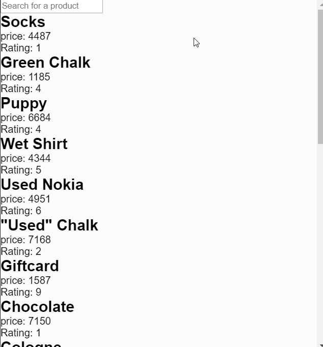
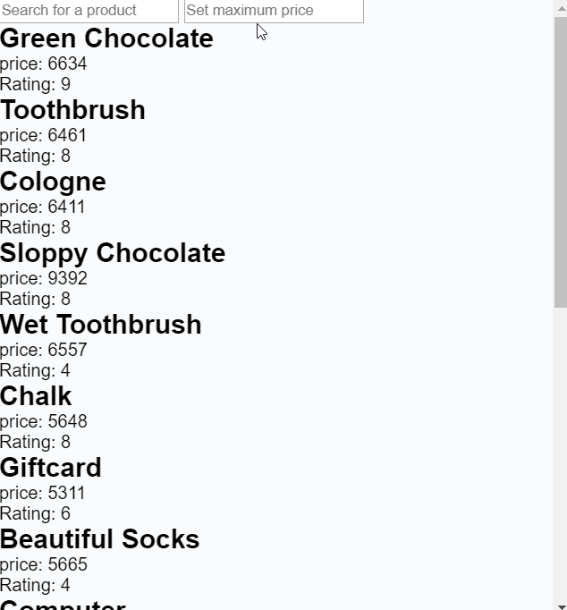

> [!WARNING]
> These are optional homework exercises that you can complete on top of your [homework project](/homework-projects/readme.md), if you wish. These will not be reviewed.

# Optional Homework

## Why should i even do this homework?

Working with arrays is an essential part of being a javascript developer. A lot of the time js developers have an array of some objects. That could be **users, products, posts, jobs** etc. Working with these arrays, js developers so often need to filter the arrays, change the structure of the array, sort them or loop through them.

On top of that combining these array function with each other will show the functional side to javascript in a nice way.

The warmup exercises will be a bit abstract. But the in the **hyfBay exercise** the task will be a lot closer to a **real world task**.

## Appreciate how far you have come

Javascript is getting difficult now and we are aware of that! Take some time to appreciate how far you have come that last 6 weeks. Instead of comparing yourself to others, compare yourself to where you were a some time ago. If you are seeing progress then you are doing it right 💪

## Overview of homework

1. **[Warmup array exercises:](#1-warmup-array-exercises)** Warmup exercise that includes

   - Doubling the number
   - ⭐ Working with movies

2. 🌟 **[hyfBay](#hyfbay):** It's a single-page app where users can search for products.

# 1. Warmup array exercises

If you struggle to do this weeks homework there are a couple of things to do:

- Try watch this video: https://www.youtube.com/watch?v=Urwzk6ILvPQ
- Watch the class recording. If it for some reason is missing. Then watch these: [part 1](https://www.youtube.com/watch?v=AJt_O0EFDC8), [part 2](https://www.youtube.com/watch?v=4tj7CvD7ka8), [part 3](https://www.youtube.com/watch?v=CO40FG6pK2k) [part 4](https://www.youtube.com/watch?v=eA2tCs0AaaM)
- Read up on array functions [here](https://github.com/HackYourFuture-CPH/JavaScript/blob/main/javascript2/week2/readme.md#array-methods-map-filter-and-sort)

## 1.1. Doubling of number

Say you would like to write a program that **doubles the odd numbers** in an array and **throws away the even number**.

Your solution could be something like this:

```js
let numbers = [1, 2, 3, 4];
let newNumbers = [];

for (let i = 0; i < numbers.length; i++) {
  if (numbers[i] % 2 !== 0) {
    newNumbers[i] = numbers[i] * 2;
  }
}

console.log("The doubled numbers are", newNumbers); // [2, 6]
```

Rewrite the above program using `map` and `filter` don't forget to use arrow functions.

<br/>

## 1.2. codewars!

Complete these Katas:
- [8 kyu To square(root) or not to square(root)](https://www.codewars.com/kata/57f6ad55cca6e045d2000627)
- [8 kyu Removing Elements](https://www.codewars.com/kata/5769b3802ae6f8e4890009d2)

<br/>

## 1.3. Working with movies


Copy the movies array in the [movies](homework/movies.js) file. Use this array to do the following tasks:

1. Create an array of movies containing the **movies with a short title** (you define what short means)
2. Create an array of movie titles with **long movie titles**
3. Count the **number of movies** made between 1980-1989 (including both the years)
4. Create a new array that has an **extra key called tag**. The tag is based on the rating: Good (>= 7), Average (>= 4 and < 7), Bad (< 4)
5. **Using [chaining](readme.md#chaining)**, first filter the movies array to only contain the movies rated higher than 6. Now map the movies array to only the rating of the movies.
6. **Count the total number of movies** containing any of following keywords: `Surfer`, `Alien` or `Benjamin`. So if there were 3 movies that contained `Surfer`, 1 with `Alien` and 2 with `Benjamin`, you would return 6. Can you make sure the search is case insensitive?
7. Create an array of movies where a **word in the title is duplicated**. Fx "Star **Wars**: The Clone **Wars**" the word **Wars** is duplicated. Here are some madeup examples of movies with duplicated words in the title: "**The** three men and **the** pistol", "**Chase** three - The final **chase**"
8. Calculate the **average rating** of all the movies using [reduce](https://developer.mozilla.org/en-US/docs/Web/JavaScript/Reference/Global_Objects/Array/Reduce). _Optional_
9. **Count the total number** of Good, Average and Bad movies using [reduce](https://developer.mozilla.org/en-US/docs/Web/JavaScript/Reference/Global_Objects/Array/Reduce). A return could fx be `{goodMovies: 33, averageMovies: 45, goodMovies: 123}` _Optional_

# 2. hyfBay - get the okay'est products here - continued <a id='hyfbay'></a>

**Continue work on your homework regarding the Hyfbay** from previous week. Please copy the files from last week into this weeks `hyf-homework` folder and continue working there. If you have not made last weeks homework the solution for it is included in [this weeks homework folder](homework/hyf-bay) in the `main.js` file.

## 2.1. Filter products

A very normal usecase for a product site is that a **user wants to search for some product** or find products that are cheaper than a set price. Lets implement that functionality for a user!

BUT first lets figure out what happens on a conceptual level, when a user filters some products:

1. Some kind of **event happens**, fx a user searches for a product, we need to listen for that event
2. When that event happens we need to **filter the products** the user wants
3. Then we should **render those products**

Lets get a little closer to javacript:

1. `.addEventListener` on an element
2. `.filter` on the products array
3. `renderProducts` with the filtered array

## 2.2 Searching for products

A user needs to search for products. That means that we need to add an input element to the html.

When the user writes something in the search input field. The products should be updated to only include the products that match the name.

So what event should we listen for in the `addEventListener` method? And what element should we listen on?

Use the overview shown above and the `renderProducts` function.



## 2.3. Filter products based on max price

Lets help a user to find cheap products! When the **user writes a maximum price** the products should be filtered to match that maximum price

_Hint: Break this task into smaller tasks!_



## 2.4. Make the website look nicer!

The website looks awful now, **but** luckily you have had css and html and know exactly what it takes to make this website shine!

Improve it how you see fit. Maybe add a footer, header, logo, title, styling, responsivity. Whatever you feel like would improve the site!

## 2.5. Create some extra feature

No matter how small or how big. Create some feature that would be **cool/helpful/quirky/funny**.

## 2.6 Sort the products - _optional_

This task is more open ended! So you need to come up with fx how the user should interact with the functionality.

Give the user the possibility to sort the products. That could fx be on price, name, rating or all of the above!

<br/>