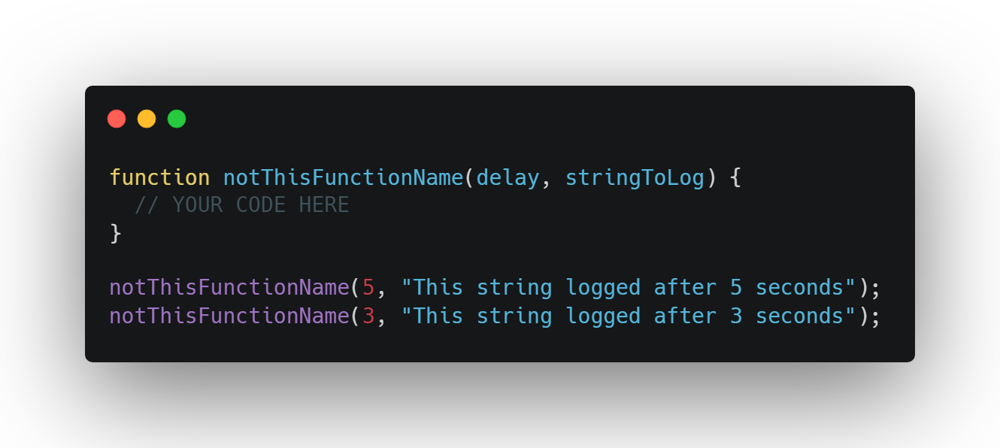
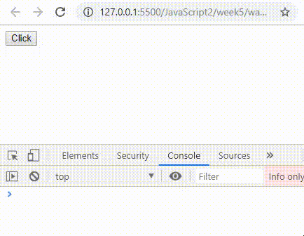
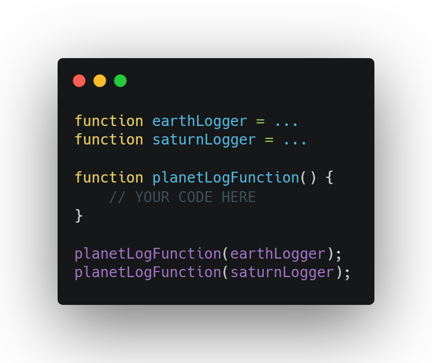
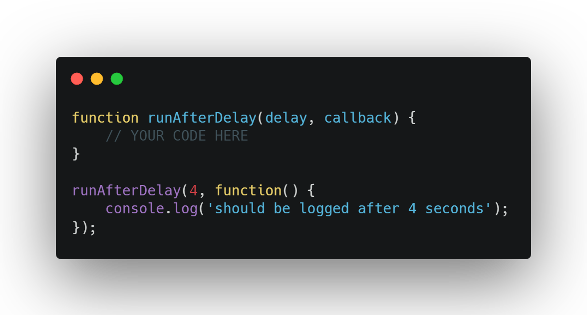

<table><tr><td>⚠️ You do not need to complete these homeworks. We are currently trialling alternative homeworks for JS2 and JS3. More info <a href="https://github.com/HackYourFuture-CPH/js-projects">here.</a></td></tr></table>

# Homework

## Start the homework

Need to brush up on the homework setup process? Check [this](https://github.com/HackYourFuture-CPH/Git/blob/main/homework_hand_in.md) out before you get into some git confusion!

## So why this homework?

Working with functions in javascript is such an essential part of working with javascript.

We want you to realise that **functions are just variables** in javascript. It is exactly the same as string or a number. This homework forces you into using functions in weird ways that forces you to think differently about functions.

# 1. Warmup

## 1.1 codewars!

- [7 kyu Product Array (Array Series #5)](https://www.codewars.com/kata/5a905c2157c562994900009d/javascript)

## 1.2 functions! 

If you struggle to do this weeks homework there are a couple of things to do:

- Try watch this video: https://www.youtube.com/watch?v=Nau-iEEgEoM
- Watch the class recording. If it for some reason is missing. Then watch these: [part 1](https://www.youtube.com/watch?v=57bGm2wa2JM), [part 2](https://www.youtube.com/watch?v=Rpvuz2ywiQM), [part 3](https://www.youtube.com/watch?v=bjvplXwTsyo) [part 4](https://www.youtube.com/watch?v=YE_off9euAc)
- Read up on functions, callback async and synchronous functions [here](readme.md#callbacks)

The warmup is a **little abstract**, it will get more concrete later on!

1. Log out the text `Called after 2.5 seconds` 2.5 seconds after the script is loaded.

2. Create a function that takes 2 parameters: `delay` and `stringToLog`. Calling this function should log out the `stringToLog` after `delay` seconds. Call the function you have created with some different arguments.
   

3. Create a button in html. When clicking this button, use the function you created in the previous task to log out the text: `Called after 5 seconds` 5 seconds after the button is clicked.

4. Create two functions and assign them to two different variables. One function logs out `Earth`, the other function logs out `Saturn`. Now create a new third function that has one parameter: `planetLogFunction`. The only thing the third function should do is call the provided parameter function. Try call the third function once with the `Earth` function and once with the `Saturn` function.

5. Create a button with the text called "Log location". When this button is clicked the location (latitude, longitude) of the user should be logged out using this [browser api](https://developer.mozilla.org/en-US/docs/Web/API/Geolocation_API)

6. _Optional_ Now show that location on a map using fx the [Google maps api](https://developers.google.com/maps/documentation/javascript/tutorial)

7. Create a function called `runAfterDelay`. It has two parameters: `delay` and `callback`. When called the function should wait `delay` seconds and then call the provided callback function. Try and call this function with different delays and different callback functions

8. Check if we have double clicked on the page. A double click is defined by two clicks within 0.5 seconds. If a double click has been detected, log out the text: "double click!"

9. Create a function called `jokeCreator` that has three parameters: `shouldTellFunnyJoke` - boolean, `logFunnyJoke` - function and `logBadJoke` - function. If you set `shouldTellFunnyJoke` to `true` it should call the `logFunnyJoke` function that should log out a funny joke. And vice versa.

# 2. Function as a variable

Create funtions that are used in these different ways:

- Create an array with 3 items. All items should be functions. Iterate through the array and call all the functions.
- Create a function as a const and try creating a function normally. Call both functions. Read up on this if you are interested: https://stackoverflow.com/questions/1013385/what-is-the-difference-between-a-function-expression-vs-declaration-in-javascrip
- Create an object that has a key whose value is a function. Try calling this function.

Yes i know that was a little tough, now on to the fun part 🎉

# 3. The fastest presser in this realm

Lets create a fun simple game :)

Here is the setup of the game: **Two users compete** about who can **press a key the most times** within a set time!

A user specifies how long time the game should be, and presses **"start game!"**. When the button is pressed it is about pressing either `l` or `s` on the keyboard. The user that has the highest number of keypresses after the time is up, wins 🎉

Here is a gif of how the site should work:

You can implement it exactly like you want to, but here is my recommended order:

1. **Create an input and a button in html**. When the button is clicked, get the value of the input. This value will be the amount of time the game should run.
2. **Set a timeout for the time specified by the user.** After that time has run out just log out a simple string.
3. **Create an event listener** so you can call a function **when any key is pressed**. Now grap the actual key that was pressed. Fx was it a `j` or an `i`. We are interested in `s` and `l`. Here google is your friend!
4. **Keep a counter** for how many times `l` and `s` was pressed.
5. **Now put it all together!** After the timeout is done figure out which of the counters is largest. Give some kind of feedback to the users indicating who won.

## 2.1 Extra features

1. **Start a new game** functionality. Create some functionality so that the users can restart a game.
2. Try and give the site some **styling so it looks nice** :)
3. **Custom feature**. Add something unique to the game! If you dont know how to implement it, just describe what it should do!
4. **Countdown to end of game** - _optional_. Have a countdown that simply counts down until the game is done.

Here are some general things to consider:

- What if a user starts pressing a key before the game is started, what should happen?
- What if the game is a draw? Are both winners? None winners? Maybe indicate to the user that is was a draw.
- What if no time was specified for the game?
- What if there were no key presses before the game ends?

## 3.3 Confetti

If you wanna give the game some confetti like in the gif, check out [this library](https://www.npmjs.com/package/confetti-js)

Use the library in your page by adding this line before you load your main.js:

``

---

If you have **any feedback to this specific homework** please fill in this [**quick google form**](https://forms.gle/S5ag1NKg7MdTXgry5)

 

## Hand in homework

Need to brush up on the homework hand-in process? 
Check [this resource](https://github.com/HackYourFuture-CPH/Git/blob/main/homework_hand_in.md) to remember how to hand in the homework correctly!

 

## Feedback

And finally, please take 5 minutes to give the mentors and staff feedback by filling out the survey [here](https://forms.gle/Kdt8WEdmx595hijN9).
