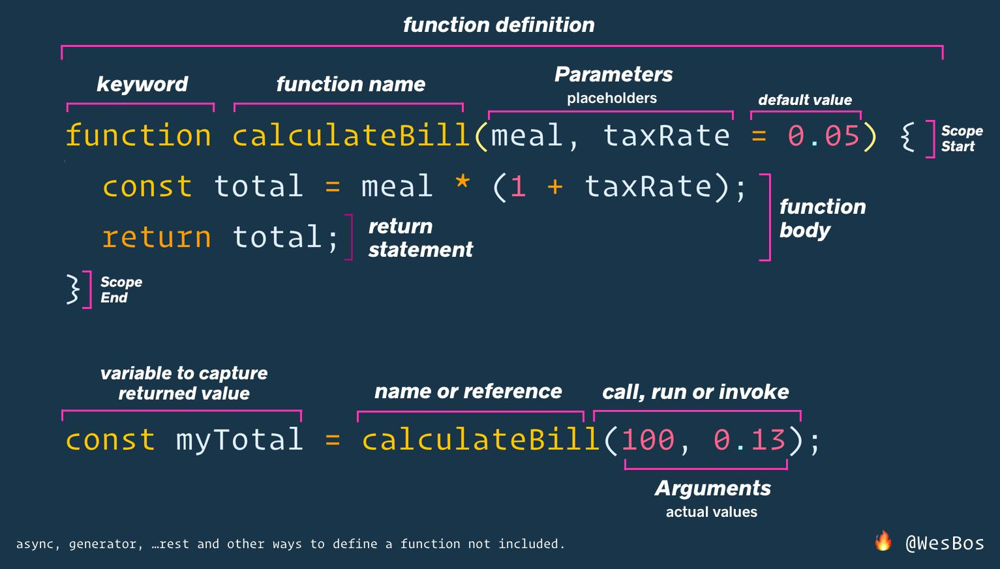

# Lesson plan
```
> Focus on having lots of in class exercises.

> DONT teach everything, let the students investigate topics on their own aswell!

> Focus on how to read documentation, google answers and google errors!!

> Teach towards the students being able to solve the homework
```

Remember to add the code you wrote in the class to the relevant class branch's class work folder. If the branch has not been created just create and push it :) If you dont have access, write to one from the core team. You can see an example below!

To find examples of what teachers have taught before go to the class branches in the classwork folder, Fx [class 07](https://github.com/HackYourFuture-CPH/JavaScript/tree/class07/JavaScript1/Week1/classwork)

If you find anything that could be improved then please create a pull request! We welcome changes, so please get involved if you have any ideas!!!

---
- Function as a variable - function can be called inside another function, like we saw with the homemade `forEach`
  - [Code inspiration](#calling-a-function-within-a-function)
- Callback function and asyncronicity - shows a practical example of function that gets called by another function (fx `setTimeout` or `addEventListener`)
  - [Code inspiration](#callback-functions)
- Anonomyous function vs named function
    - [Code inspiration](#anonomous-vs-named-function)
- [Exercise 1](#click-counter), [exercises 2](#delay-clicker), [exercise 3](#page-onload), [exercises 4](#mouse-position)
- Scope - Only if the students needs this! Ask to their abilities!

The students should after the class **feel comfortable with callback functions** and the fact that a **function works just like a variable** that can be passed around. Also asynchronicity is important, when is a function called and where does it stop. 

Also hammer in the point of the difference between:
```js
document.querySelector('button').addEventListner('click', logOuttext);
document.querySelector('button').addEventListner('click', logOuttext());
```

Good example of practical example of callbacks: https://github.com/HackYourFuture-CPH/JavaScript/blob/class08/JavaScript2/Week5/classwork/extra_examples.md

At this point good coding practices is starting to get very important! Check our [coding best practices](https://github.com/HackYourFuture-CPH/curriculum/blob/master/review/review-checklist.md#javascript) and use these both when live coding but also in reviews.

This is super good at explaining function logic


## Code inspiration

### Calling a function within a function

```js
// Here we create a funtion that as a parameter takes a function!! Super weird right!? 
// Functions works just like any other type in js. 
function functionRunner(functionToRun) {
  console.log(typeof functionToRun);
  // Here we are calling the function that is provided as an argument when calling functionRunner
  functionToRun();
}

functionRunner(function() {
  console.log('hello');
});

// We dont see anything, why??
functionRunner(Math.random);

// Lets rewrite functionRunner to log out the return of a function 
function functionRunnerImproved(functionToRun) {
  console.log(typeof functionToRun);
  // Here we are calling the function that is provided as an argument when calling functionRunner
  const capturedReturnValue = functionToRun();
  console.log(capturedReturnValue);
}

functionRunnerImproved(Math.random);

```

### Callback functions 
```js
/*
Events
Events in javascript are thing like:
A timer has just finished, a user clicked a button, our page has loaded,
someone types into an input element or we have just gotten some data from a server. 
When these events happen, we usually want to add some functionality. 
Fx when a user clicks the like button (event), we want to increment the like counter and color the like button blue.
Or when someone clicks "Close cookies" (event) we want to remove the cookie div.
Lets first try to create some js that waits for 2 seconds and the console.logs out "2 seconds has elapsed!"
In javascript we use the word eventlistener to listen  
*/

// Tried to find actual webkit implementation, but failed. To show that the setTimeout implementation is just calling the provided function after a given time
setTimeout(function() {
    console.log("2 seconds has elapsed!");
}, 2000);


// Cool, now lets make a function as a variable:
const fourSecondLog = function() {
    console.log("4 seconds has elapsed!");
}

setTimeout(fourSecondLog, 4000);


// Now lets try and log out "button clicked!" when a button is clicked.
// To check if a button gets clicked we use a what is called an eventlistener.
// Imagine a person listening to the click of a button and everytime he hears a click he yells out "CLICKED".
const buttonElement = document.querySelector('button');
buttonElement.addEventListener('click', function() {
    console.log("Button clicked!");
});


const buttonClicked = function(){
    console.log("Button clicked as a variable!");
}
// Cool man! Lets try and add that function as a variable.
buttonElement.addEventListener('click', buttonClicked);


//Callbacks 
// Now lets learn about callbacks!
// Well actually you have already made callbacks!
// When you give a function to an event listener or a timer or when fetching data you are using a callback function

// Lets create a callback function when someone writes in a input element
const callback = function() {
    console.log("Someone is writing!!");
}

document.querySelector('input').addEventListener('input', callback);

```


### Anonomous vs named function

```js

// Named function
function myFunction () {
  console.log('myFunction')
}

// Anonymous function, assigned to a variable
const myFunctionAsVar = function () {
  console.log('myFunctionAsVar')
}

document.body.addEventListener('click', myFunctionAsVar)
document.body.addEventListener('click', myFunction)

```

## Exercises
These could be more real world examples. Any ideas? Make a PR :)

### Click counter
Create an `index.html` file with two buttons:
- When the button first is clicked it should first log out 0. The next time it is clicked it should log out 1, etc.
- Clicking the second button should also count up and logout the same variable.

### Delay clicker
Create a button in html with the text "Log in 3 seconds"
- When the button is clicked it should wait 3 seconds and then log the text "This text was delayed by 3 seconds".

### Page onload
First create a callback function as a variable that logs this out: "DOM fully loaded and parsed"
This callback function should be called when the DOM is fully loaded.
To find what this function is called go to google! What should we search for???

### Mouse position
Create a handler, that prints the x,y coordinate of the mouse event.

#### Mouse position online tool
Say we want to create an online tool where businesses can see where their users' mouse is most of the time. Businesses can now figure out if they have designed their website correctly. 

 Lets create some js that will get the average `x` and `y` position of a user after 30 seconds. 

Before starting with this exercise, create a plan for how you will implement this! Maybe together with your mentor. 
