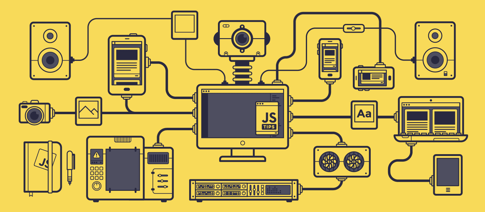

> Please help us improve and share your feedback! If you find better tutorials or links, please share them by opening a Pull Request.   
> 
> **Kind note:**  
We expect you to **always** come prepared to the class on Sunday.
<h1 align='center'>
 HackYourJavaScript
</h1>   

  

   

## What is JavaScript?   
'JavaScript is a programming language that adds interactivity to your website (for example: games, responses when buttons are pressed or data entered in forms, dynamic styling, animation).'   
Read this intro article on [JavaScript](https://developer.mozilla.org/en-US/docs/Learn/Getting_started_with_the_web/JavaScript_basics)

This JavaScript course is divided in three modules. Starting from the simple uses and understanding the basics to the more complex features of the language. 

## Module goals:

### [Week 1-3:](/JavaScript1)   
A basic program with multiple functions (reacting to user input)

### [Week 4-6:](/JavaScript2)
A tool capable of loading a JSON file and representing it in the DOM

### [Week 7-9:](/JavaScript3)
A web app with external data source using at least one API

### Overall
A good understanding of all the above mentioned topics. Want to check your Knowledge?    
Go through the [JavaScript Fundamentals readme](/fundamentals) and research/ask for help [(Slack!)](https://hackyourfuture-cph.slack.com) with the concepts that are not entirely clear.

Helpful resource: http://jsbooks.revolunet.com/ (here you can find tons of free JavaScript books online)

